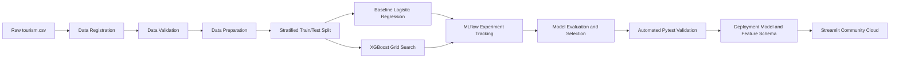

# Tourism Package Purchase Prediction — MLOps Project

[](https://github.com/fluxaieon/Tourism_MLOps_Project/actions/workflows/pipeline.yml)
[](https://www.python.org/)
[](https://avinash-tourism-package-prediction-mlops.streamlit.app/)
[](https://mlflow.org/)

An end-to-end machine learning and MLOps solution for predicting whether a customer is likely to purchase a tourism package using information available before customer contact.

## Live Application

**[Open the Tourism Package Purchase Prediction App](https://avinash-tourism-package-prediction-mlops.streamlit.app/)**

The Streamlit application accepts 13 pre-contact customer attributes and returns:

- the predicted purchase class;
- the estimated purchase probability;
- a marketing-priority recommendation;
- the exact model-input record used for inference.

## Business Objective

The project supports marketing teams in prioritizing prospective customers before initiating a sales interaction.

Only attributes available before customer contact are used for deployment. The following interaction-stage variables are intentionally excluded to prevent temporal leakage:

- `TypeofContact`
- `DurationOfPitch`
- `NumberOfFollowups`
- `ProductPitched`
- `PitchSatisfactionScore`

The resulting model provides decision support rather than an automated customer-selection decision.

## MLOps Architecture



## Dataset Summary

| Property | Value |
|---|---:|
| Raw records | 4,128 |
| Raw columns | 21 |
| Positive target proportion | 19.31% |
| Training records | 3,302 |
| Testing records | 826 |
| Prepared predictors | 18 |
| Deployment predictors | 13 |
| Target | `ProdTaken` |

Data preparation includes:

- removal of the `Unnamed: 0` CSV export artifact;
- removal of the unique `CustomerID` identifier;
- correction of inconsistent categorical labels;
- stratified 80:20 training and testing split;
- validation of target balance and output schemas.

## Data Quality Corrections

| Column | Original value | Standardized value | Records |
|---|---|---|---:|
| `Gender` | `Fe Male` | `Female` | 155 |
| `Occupation` | `Free Lancer` | `Freelancer` | 2 |
| `MaritalStatus` | `Unmarried` | `Single` | 682 |

## Model Development

Two model-development stages are tracked with MLflow:

1. Logistic Regression establishes an interpretable baseline.
2. XGBoost is tuned using stratified five-fold cross-validation and `GridSearchCV`.

### Selected XGBoost Parameters

| Hyperparameter | Selected value |
|---|---:|
| `n_estimators` | 200 |
| `max_depth` | 5 |
| `learning_rate` | 0.1 |
| `subsample` | 0.8 |
| `colsample_bytree` | 0.8 |

## Model Performance

| Model or metric | Score |
|---|---:|
| Logistic Regression CV ROC-AUC | 0.7929 |
| Tuned XGBoost CV ROC-AUC | 0.9019 |
| Test accuracy | 0.8680 |
| Test precision | 0.6453 |
| Test recall | 0.6981 |
| Test F1-score | 0.6707 |
| Test ROC-AUC | 0.9037 |

The tuned XGBoost pipeline is selected because it produces a substantial cross-validation ROC-AUC improvement over the baseline while maintaining comparable validation and unseen-test performance.

## Deployment Features

The production model uses the following 13 pre-contact attributes:

1. `Age`
2. `CityTier`
3. `Occupation`
4. `Gender`
5. `NumberOfPersonVisiting`
6. `PreferredPropertyStar`
7. `MaritalStatus`
8. `NumberOfTrips`
9. `Passport`
10. `OwnCar`
11. `NumberOfChildrenVisiting`
12. `Designation`
13. `MonthlyIncome`

The serialized deployment artifact contains the complete preprocessing and classification pipeline, ensuring that training and inference apply identical transformations.

## Automated CI/CD Pipeline

The GitHub Actions workflow runs automatically on pushes to `main` using Python 3.11.

```text
Data Registration
       ↓
Data Preparation
       ↓
Model Training and MLflow Tracking
       ↓
Automated Deployment Validation
```

The workflow:

- validates the registered dataset;
- generates stratified train/test artifacts;
- trains and tunes the models;
- records MLflow experiments and evaluation outputs;
- executes six automated tests;
- validates the Streamlit application;
- uploads traceable workflow artifacts;
- commits the validated model and feature schema for deployment.

### Retained Workflow Artifacts

| Artifact | Purpose |
|---|---|
| `registered-data` | Validated source dataset |
| `prepared-data` | Training and testing splits |
| `trained-model` | Deployment model and feature schema |
| `experiment-results` | MLflow records and evaluation outputs |
| `automated-test-results` | JUnit XML test report |

## Automated Tests

The test suite validates:

- registered dataset integrity;
- prepared train/test splits;
- leakage-safe deployment schema;
- valid model prediction and probability output;
- Streamlit application readiness;
- GitHub Actions workflow completeness.

```bash
python -m pytest tourism_project/tests --verbose
```

Expected result:

```text
6 passed
```

## Repository Structure

```text
Tourism_MLOps_Project/
├── .github/
│   └── workflows/
│       └── pipeline.yml
├── tourism_project/
│   ├── data/
│   │   └── tourism.csv
│   ├── deployment/
│   │   ├── app.py
│   │   ├── feature_schema.json
│   │   ├── requirements.txt
│   │   └── tourism_model.joblib
│   ├── model_building/
│   │   ├── data_register.py
│   │   ├── prep.py
│   │   └── train.py
│   ├── tests/
│   │   └── test_pipeline.py
│   └── requirements.txt
└── README.md
```

Processed datasets, MLflow tracking files, test reports, and evaluation outputs are generated during execution and passed between GitHub Actions jobs as workflow artifacts.

## Local Execution

### 1. Clone the repository

```bash
git clone https://github.com/fluxaieon/Tourism_MLOps_Project.git
cd Tourism_MLOps_Project
```

### 2. Create and activate a Python 3.11 environment

Linux or WSL:

```bash
python3.11 -m venv .venv
source .venv/bin/activate
```

Windows PowerShell:

```powershell
py -3.11 -m venv .venv
.venv\Scripts\Activate.ps1
```

### 3. Install the project dependencies

```bash
python -m pip install --upgrade pip
python -m pip install -r tourism_project/requirements.txt
```

### 4. Execute the pipeline

```bash
python tourism_project/model_building/data_register.py
python tourism_project/model_building/prep.py
python tourism_project/model_building/train.py
python -m pytest tourism_project/tests --verbose
```

### 5. Launch the Streamlit application

```bash
streamlit run tourism_project/deployment/app.py
```

## Technology Stack

- Python 3.11
- pandas and NumPy
- scikit-learn
- XGBoost
- MLflow
- Pytest
- GitHub Actions
- Streamlit Community Cloud

## Responsible Use and Limitations

- The dataset is moderately imbalanced, with approximately 19% positive purchases.
- Predictions describe patterns in the supplied dataset and do not establish causal relationships.
- The model should support, not replace, appropriate business review.
- Production use should include monitoring for data drift, performance degradation, and unintended customer-group disparities.
- Retraining should occur when customer behavior or package offerings materially change.

## Author

**Avinash Giri**  
GitHub: [@fluxaieon](https://github.com/fluxaieon)

